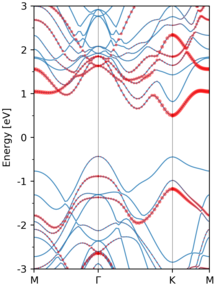
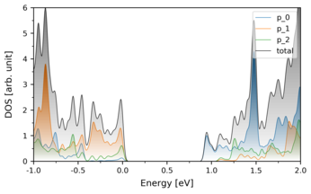

# Introduction

`pyband` and `pydos` are two python scripts that analyse the VASP calculation
results (e.g. OUTCAR and PROCAR) and  convert the results to images. It offers a
fast and effective way to preview the calcuated results. The image plotting
utilizes `matplotlib` package.

# Examples
## pyband

When no argument is given, `pyband` reads in `OUTCAR` (optionally `KPOINTS`)
and find the band information within. It then plots the resulting band structure
and save it as `band.png`.

```$ pyband```


The default output image name  can be changed by adding `-o
YourImageName.suffix` to the above command line.  Note that the image format is
automatically recognized by the script, which can be any format that is
supported by `matplotlib`. The size of the image can also be speified by `-s
width height` command line arguments. 

The labels of the high-symmetry K-points, which are not shown in the figure, can
be designate by `-k` flag.

```$ pyband -k mgkm```


In some cases, if you are interested in finding out the characters of each KS
states, e.g. the contribution of some atom to each KS state, the flag `--occ
atoms` comes to help.

```$ pyband --occ '1 3 4'```


where `1 3 4` are the atom index starting from 1 to #atoms  in the above image.
The size of red dots in the figure indicates the weight of the specified atoms
to the KS states.  This can also be represented using a colormap:

```$ pyband --occ '1 3 4' --occL```


The spd-projected weight can also be specefied:

```$ pyband --occ '1 3 4' --spd '4 5 6 7 8' ```



where in the arguments of `--spd`:


> s orbital: 0

> py, pz, px orbital: 1 2 3

> dxy, dyz, dz2, dxz, dx2 orbital: 4 5 6 7 8

More command line arguments can be found by `pyband -h`.

## pydos

This script is used to plot partial density of states (pDOS) from VASP `PROCAR`
files. 

`pydos -p '1 3 4' -p '2 7 8' -p '5 6 9' -z 0.65 -x -1 2  -y 0 6`



where `-p` specifies the atom indexes, `-x` and `-y` determines the x and y
limits of the plot, `-z` is followed by the energy reference of the plot.


## npdos

This script can plot PDOS from multiple VASP `PROCAR`s, example usages:
```bash

#!/bin/bash

# npdos \
#     -i 00/PROCAR -p "1:3"  -l x1 -yshift 10 \
#     -i 01/PROCAR -p "1:3"  -l x2 -yshift 20 \
#     -i 02/PROCAR -p "1:3"  -l x3 -yshift 30 \
#     -i 03/PROCAR -p "1:3"  -l x4 -yshift 40 \

# npdos \
#     -nr 2 -nc 1 -f 6 4.0              \
#     -a 0 -i 00/PROCAR -p "0:3"  -l x1 -xshift  1.0\
#     -a 0 -i 01/PROCAR -p "3:6"  -l x2 -xshift  1.0\
#     -a 1 -i 02/PROCAR -p "0:3"  -l x3 -xshift -0.0\
#     -a 1 -i 03/PROCAR -p "3:6"  -l x4 -xshift -0.0\

npdos \
    -nr 2 -nc 1 -f 4.8 4.0  -sharex \
    -a 0 -i 00/PROCAR -p "0:3"  -x -3 3 -l x1 -xshift  1.0 \
    -a 0 -i 00/PROCAR -p "3:6"  -l x2 -xshift  1.0 \
    -a 1 -i 00/PROCAR -p "0:3"  -x -4 4 -l x3 -xshift -0.0 \
    -a 1 -i 00/PROCAR -p "3:6"  -l x4 -xshift -0.0 \

```

